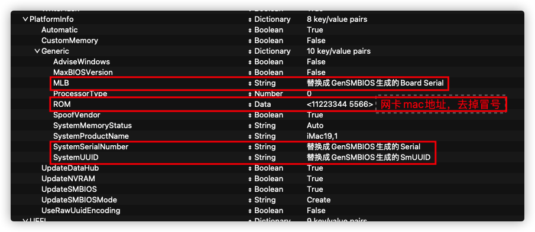

# 微星B460M MORTAR WIFI i7-10700 核显 黑苹果 OpenCore驱动

## 系统信息

OpenCore版本：0.6.6

MacOS版本：big sur 11.2

可用功能：以太网、wifi、蓝牙、USB映射、节能五项。。。

遗留问题：

1. 关机后自动重启（尝试了很多方法仍然没有解决，希望有方案的大神分享一下）
2. 双屏幕开机会花屏，解决办法：单屏幕开机完成之后再打开第二个屏幕，如果已经双屏幕开机产生花屏，可以关闭一个屏幕再打开

## 主要硬件

| 配置      | 型号                            |
| -------- | ------------------------------- |
| 主板      | 微星B460M MORTAR WIFI           |
| CPU      | i7-10700                        |
| 显卡      | 核显 UHD630                     |
| wifi 蓝牙 | 板载                            |
| 内存      | 2 x 32G 金士顿 DDR4 2666 骇客神条 |
| 显示器    | 2 x Redmi 23.8英寸              |
| 连接线    | 绿联 DP转HDMI转换器连接线          |
| 固态硬盘  | SAMSUNG 970 EVO 500G            |
| 机械硬盘  | 西数 紫盘 4TB                    |

## 驱动简介

```
EFI
├── BOOT
│   └── BOOTx64.efi
└── OC
    ├── ACPI ······························ DSDT补丁目录
    │   ├── SSDT-AWAC.aml ················· 时钟补丁
    │   ├── SSDT-EC-USBX.aml ·············· EC和USBX补丁
    │   ├── SSDT-PLUG.aml ················· 节能四项补丁
    │   ├── SSDT-PM.aml ··················· 节能五项补丁
    │   └── SSDT-RHUB.aml ················· 修复丢失的USB接口
    ├── Drivers
    │   ├── OpenCanopy.efi
    │   ├── OpenHfsPlus.efi
    │   └── OpenRuntime.efi
    ├── Kexts ····························· 驱动目录
    │   ├── AirportItlwm.kext ············· 板载无线网卡
    │   ├── AppleALC.kext ················· 声卡
    │   ├── IntelBluetoothFirmware.kext ··· 板载蓝牙，如果蓝牙开关不显示，加上IntelBluetoothInjector.kext
    │   ├── Lilu.kext ····················· 必备
    │   ├── LucyRTL8125Ethernet.kext ······ 有线网卡
    │   ├── NVMeFix.kext ·················· 提高非苹果SSD兼容性
    │   ├── SMCProcessor.kext ············· 监控CPU温度
    │   ├── SMCSuperIO.kext ··············· 监控风扇转速
    │   ├── USBMap.kext ··················· 手动创建的USB映射
    │   ├── VirtualSMC.kext ··············· 必备
    │   ├── WhateverGreen.kext ············ 必备
    ├── OpenCore.efi
    ├── Resources ························· 引导界面资源
    ├── Tools ····························· 引导界面工具
    │   ├── OpenShell.efi ················· 必备
    │   └── acpidump.efi ·················· 导出DSDT工具
    └── config.plist ······················ OpenCore配置文件
```

## 使用

参考下图修改



## 参考
[mrdonkey3/hackintosh-oc-msi-b460m-mortar-i7-10700-big-sur](https://github.com/mrdonkey3/hackintosh-oc-msi-b460m-mortar-i7-10700-big-sur)

[OpenCore Install Guide](https://dortania.github.io/OpenCore-Install-Guide/prerequisites.html)
